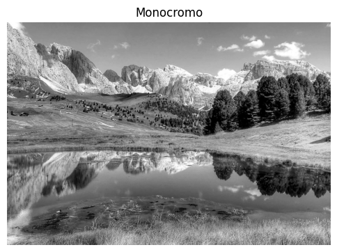

# 🧪 Taller - Explorando el Color: Percepción Humana y Modelos Computacionales

## 🔍 Objetivo

Este taller tiene como propósito investigar la percepción del color desde el punto de vista humano y computacional. Se exploran diferentes modelos de color y se representan visualmente sus efectos en imágenes. Además, se simulan condiciones específicas de percepción (como daltonismo o entornos de baja luz) para comprender cómo la transformación del color afecta la interpretación visual.

---

## 🧠 Modelos de color utilizados

- **RGB (Red, Green, Blue):** Modelo aditivo basado en cómo los monitores generan color.
- **HSV (Hue, Saturation, Value):** Modelo que separa el matiz del brillo y saturación. Útil para manipulación intuitiva del color.
- **CIE Lab (Lightness, a, b):** Modelo perceptualmente uniforme. Utilizado para cálculos de diferencia de color.

---

## 🖼️ Comparación visual de modelos de color

### 📷 Imagen original

### 🎨 HSV - Hue, Saturation, Value
- **Canal H (Hue):**  
  .png)
- **Canal S (Saturation):**  
  .png)
- **Canal V (Value):**  
  .png)

### 🌈 CIE Lab - Lightness, a, b
- **Canal L (Lightness):**  
  .png)
- **Canal a (green-red):**  
  .png)
- **Canal b (blue-yellow):**  
  .png)

---

## 🧪 Simulaciones y transformaciones

### 🧑‍🦯 Daltonismo
- **Simulación Deuteranopía:**  
  

### 🌙 Baja luminosidad
- **Simulación Baja Luz:**  
  

### 🎛️ Filtros de transformación
- **Colores Invertidos:**  
  
- **Filtro de Temperatura Cálida:**  
  
- **Monocromo:**  
  

### 🔁 Simulación dinámica
- **SImulación Dinámica:**  
  

---

## 🧑‍💻 Código relevante

El taller fue desarrollado en Python, utilizando librerías como `opencv-python`, `matplotlib`, `skimage.color`, `PIL` y `numpy`.

---

## 🎯 Reflexión

Este ejercicio demuestra cómo distintos modelos de color alteran la forma en que se perciben las imágenes. Por ejemplo, en HSV, el canal Hue resalta diferencias de tono, mientras que en Lab, los canales *a* y *b* revelan relaciones perceptuales entre colores que no son tan evidentes en RGB. Las simulaciones de daltonismo o baja luz evidencian cómo pequeños cambios en la percepción afectan la interpretación visual, y por qué es importante considerar estas variables en diseño accesible.

---

## ✅ Criterios de evaluación cubiertos

- ✅ Conversión correcta entre modelos RGB ↔ HSV ↔ Lab.
- ✅ Simulaciones visuales claras de alteraciones perceptivas (daltonismo, baja luz).
- ✅ Transformaciones aplicadas correctamente sobre imágenes.
- ✅ Código modular, limpio y documentado.
- ✅ README completo con comparaciones, explicaciones e imágenes.
- ✅ Buenas prácticas en control de versiones: commits descriptivos en inglés.

---

